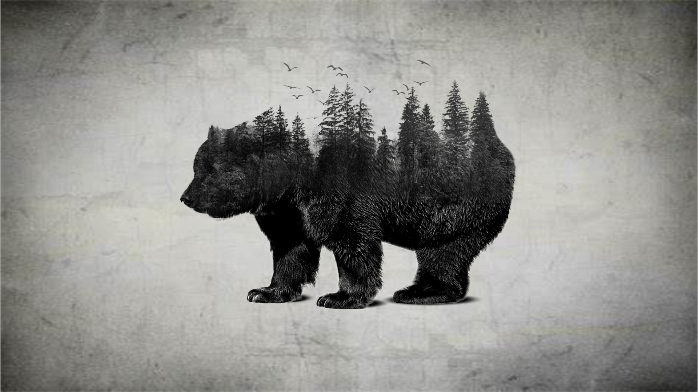

<!-- PROJECT LOGO -->
<h1 align="center">Search_app</h1>

  

# Présentation
Le site Sakus-Art, est une galerie d’art communautaire et un portfolio dont le thème est la
création artistique et l’échange communautaire.

# Conception
Dans son architecture, le site dispose d’une entête, un menu (situé à gauche) et d’un bas de page.
Puis, concernant le contenu, le site web ressemble à une galerie d’art où on peut visualiser
l’ensemble de mes oeuvres graphiques et sur papier, et également un espace où je pourrais proposer
mes services en terme de création visuelle avec des logos, des bannières, etc. sur les différents
réseaux sociaux présent sur internet ou tout simplement pour des particuliers qui ont besoin d’une
nouvelle charte graphique.

Ainsi, que la présence d’un formulaire de contact pour envoyer un mail au propriétaire du site et un
calendrier pour suivre les futurs événements à venir sur le site.

De plus, pour créer un échange avec moi et mes utilisateurs, j’ai décidé de mettre en place un espace
commentaire pour avoir un avis sur mes oeuvres et un espace de discussion, de type forum,
permettant aux utilisateurs de discuter entre eux sur des thèmes en rapport avec l’art ou tout
simplement proposer leurs oeuvres et les faire partager.

Néanmoins, pour accéder à ces espaces, l’utilisateur devra créer un compte, en tant que membre,
en y insérant ses coordonnées personnelles (pseudo, nom d’utilisateur, adresse mail et mot de
passe).

NB : L’utilisateur disposera de différents statuts : membre, modérateur ou administrateur qui en
fonction de chaque statut disposera de plus de fonctionnalités et de contrôle sur le site.

Pour finir, un espace admin sera mis en place pour l’administrateur afin de gérer l’ajout et la
suppression des oeuvres, et le contrôle des commentaires postés par les utilisateurs dans l’espace
commentaire.

# Architecture

Le site disposera de plusieurs pages dans le menu :
1. Accueil
2. Art (bouton - espace commentaire / bouton - espace aide et actualité)
3. Art Graphique (bouton - espace commentaire / bouton - espace contact et actualité)
4. Logo (bouton - espace contact / actualité)
5. Un espace commentaire pour chaque oeuvre
6. Forum de discussion
7. Formulaire de contact et Fil d’actualité
8. Calendrier des événements sur le site (avec FullCalendar)
9. Un espace administrateur (Gérer le contenu des galeries et contrôle des
commentaires)
